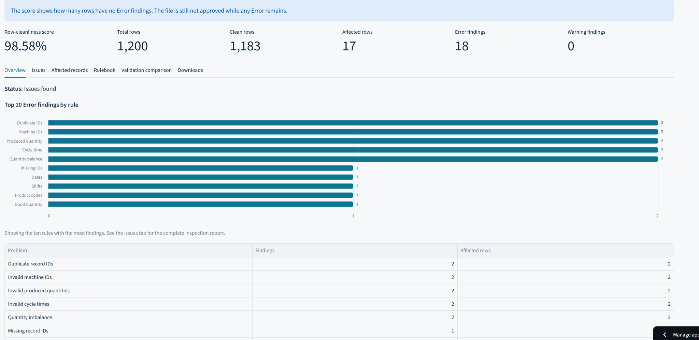
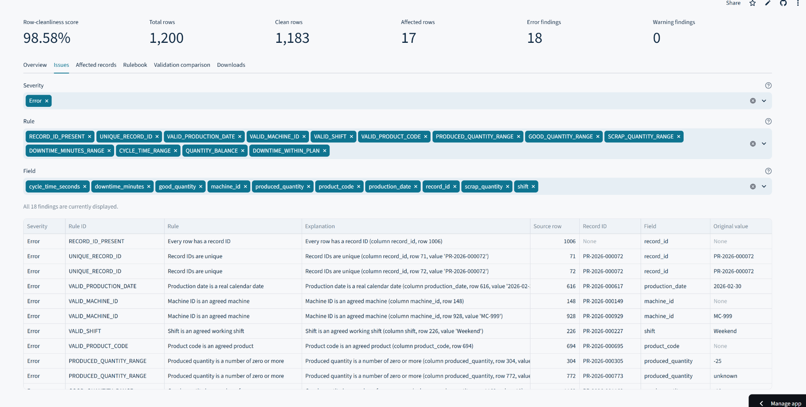
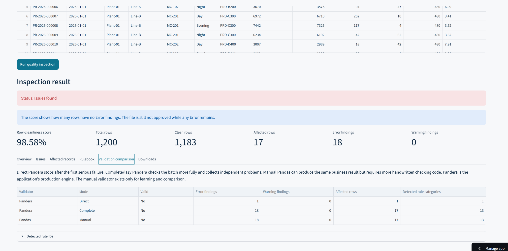
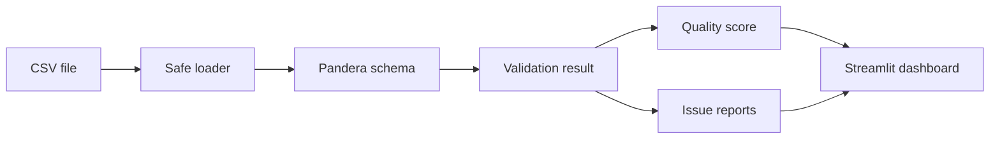

# Production Data Quality Inspector

A reusable Python data-validation project for manufacturing CSV files. It checks the structure and business rules of an incoming production extract, reports every detected problem, calculates a row-cleanliness score, and keeps the original source values unchanged.

The validation engine is built with **Pandera**. A separate manual **Pandas** validator is included for comparison and learning. **Streamlit** provides the user interface.

## Live application

[Open the Production Data Quality Inspector](https://appuction-data-quality-inspector.streamlit.app/)

## Dashboard

### Inspection overview



### Detailed findings



### Validator comparison



## What the project demonstrates

- Declarative DataFrame validation with Pandera
- Required columns and unexpected-column handling
- Missing values, uniqueness, dates, allowed values, and numeric ranges
- Cross-column business rules
- Direct validation compared with complete/lazy validation
- Pandera compared with equivalent manual Pandas checks
- Structured issue reporting with original row values
- A row-cleanliness score that does not replace the validation decision
- In-memory CSV downloads and uploads
- Automated tests with pytest
- A thin Streamlit interface over reusable Python modules

## Example result

The included demonstration dataset contains 1,200 synthetic manufacturing records and a small number of deliberately planted data-quality problems.

| Metric | Result |
| --- | ---: |
| Status | Issues found |
| Total rows | 1,200 |
| Clean rows | 1,183 |
| Affected rows | 17 |
| Error findings | 18 |
| Warning findings | 0 |
| Row-cleanliness score | 98.58% |

The file remains invalid while any Error finding exists. A high score therefore does not mean that the file is approved.

## Human workflow

1. Select the included demonstration dataset or upload a CSV file.
2. Preview the extract without changing its values.
3. Run the quality inspection.
4. Review the status, score, and most frequent problems.
5. Filter the detailed issue report or inspect the affected source records.
6. Compare Pandera validation with the manual Pandas implementation.
7. Download the generated CSV reports.

## Validation design

The project treats the schema as a data contract. The contract describes the columns and rules that a production extract must follow before another analysis or process can trust it.



The rule catalog contains 19 checks covering:

- Required and unexpected columns
- Record IDs and duplicate IDs
- Valid calendar dates
- Agreed production lines, machines, shifts, and product codes
- Numeric production, scrap, downtime, planning, and cycle-time values
- Quantity balance between produced, good, and scrap quantities
- Downtime that must not exceed planned production time

### Direct and complete validation

Direct Pandera validation stops after the first serious schema failure. Complete validation uses `lazy=True` and collects independent problems across the file. The dashboard uses complete validation because a production user normally needs a useful inspection report, not only the first error.

### Pandera and manual Pandas

The manual validator applies the same business rules with ordinary Pandas operations. It exists to make the comparison visible:

| Approach | Role in this project |
| --- | --- |
| Pandera complete | Main production validation engine |
| Pandera direct | Demonstrates fail-fast behaviour |
| Manual Pandas | Educational comparison |

Pandera keeps the contract and reusable checks in one schema. Manual Pandas offers flexibility, but it needs more handwritten checking and error-reporting code.

### Quality score

The score measures how many rows have no Error findings:

```text
clean rows = total rows - unique rows affected by Errors
score = round(clean rows / total rows * 100, 2)
```

Each affected row is counted once even when it fails several rules. Warnings do not lower the score. A file with missing required columns or no data rows is shown as **Not scorable**.

## Data

`data/production_data.csv` is a synthetic dataset created for this project. It contains no confidential production information and no personal data.

The 13 expected columns are:

| Area | Columns |
| --- | --- |
| Identification | `record_id`, `production_date`, `plant` |
| Production context | `production_line`, `machine_id`, `shift`, `product_code` |
| Quantities | `produced_quantity`, `good_quantity`, `scrap_quantity` |
| Time | `downtime_minutes`, `planned_minutes`, `cycle_time_seconds` |

The demonstration errors are intentional. Do not clean or replace the source file if you want to reproduce the documented result.

## Project structure

```text
production-data-quality-inspector/
├── .streamlit/
│   └── config.toml
├── data/
│   └── production_data.csv
├── docs/
│   ├── images/
│   │   ├── csv-upload.png
│   │   ├── dashboard-issues.png
│   │   ├── dashboard-overview.png
│   │   └── validation-comparison.png
│   ├── data_dictionary.md
│   ├── data_profile.md
│   ├── pandera_vs_manual.md
│   ├── quality_score.md
│   └── validation_rules.md
├── production_quality/
│   ├── __init__.py
│   ├── config.py
│   ├── data.py
│   ├── exceptions.py
│   ├── manual_validation.py
│   ├── models.py
│   ├── quality.py
│   ├── reporting.py
│   ├── rules.py
│   ├── schema.py
│   └── validation.py
├── tests/
│   ├── conftest.py
│   ├── test_config.py
│   ├── test_data.py
│   ├── test_manual_validation.py
│   ├── test_models.py
│   ├── test_quality.py
│   ├── test_reporting.py
│   ├── test_rules.py
│   ├── test_schema.py
│   ├── test_streamlit_app.py
│   ├── test_validation.py
│   └── test_validator_comparison.py
├── report/
│   ├── rapport_datavalidering_med_pandera_sv.pdf
├── README.md
├── requirements.txt
└── streamlit_app.py
```

## Installation

Python 3.11 is recommended.

### Windows PowerShell

```powershell
git clone https://github.com/JunusEmre/production-data-quality-inspector.git
cd production-data-quality-inspector
python -m venv .venv
.\.venv\Scripts\Activate.ps1
python -m pip install --upgrade pip
python -m pip install -r requirements.txt
```

### macOS or Linux

```bash
git clone https://github.com/JunusEmre/production-data-quality-inspector.git
cd production-data-quality-inspector
python3 -m venv .venv
source .venv/bin/activate
python -m pip install --upgrade pip
python -m pip install -r requirements.txt
```

## Run the dashboard

```bash
python -m streamlit run streamlit_app.py
```

Open the local address shown by Streamlit, normally `http://localhost:8501`.

## Run the tests

```bash
python -m pytest -q
```

The completed test suite contains 159 tests covering configuration, loading, schema behaviour, both validators, reporting, scoring, side effects, and the Streamlit workflow.

## Main modules

| Module | Responsibility |
| --- | --- |
| `config.py` | Immutable data contract and allowed business values |
| `data.py` | Safe CSV loading without business-rule repair |
| `rules.py` | Metadata for the 19 validation rules |
| `schema.py` | Pandera DataFrame schema |
| `validation.py` | Main Pandera validation service |
| `manual_validation.py` | Equivalent handwritten Pandas comparison |
| `models.py` | Structured validation issues and results |
| `quality.py` | Row-cleanliness score and status |
| `reporting.py` | In-memory issue, record, rule, and summary reports |
| `streamlit_app.py` | User interface and session workflow |

## Design decisions

- **No automatic repair:** the inspector reports the original problem instead of silently changing production data.
- **Complete validation in the dashboard:** users receive a useful batch report with independent failures.
- **Warnings and Errors remain different:** warnings can describe a concern without rejecting the file.
- **Extra columns are warnings:** additional information does not block the agreed 13-column contract.
- **The loader and validator are separate:** loading a file does not automatically apply business rules.
- **The Streamlit layer is thin:** validation can be reused without the dashboard.
- **Uploads and reports stay in memory:** the app does not save uploaded files to disk.

## Limitations

- The rules represent one manufacturing example and need configuration for another factory or process.
- The demonstration data is synthetic.
- Passing validation does not prove that every value is factually correct.
- The score counts affected rows but does not measure the business cost of each problem.
- The project detects and reports problems but does not repair or approve data.
- The deployed app is a demonstration and has no authentication or stored inspection history.

## Documentation

- `docs/data_dictionary.md` explains the dataset fields.
- `docs/data_profile.md` records the demonstration-data profile.
- `docs/validation_rules.md` documents the rule catalog.
- `docs/pandera_vs_manual.md` compares the two validators.
- `docs/quality_score.md` explains scoring and status logic.

## Main references

- [Pandera DataFrame schemas](https://pandera.readthedocs.io/en/stable/dataframe_schemas.html)
- [Pandera lazy validation](https://pandera.readthedocs.io/en/stable/lazy_validation.html)
- [Pandas documentation](https://pandas.pydata.org/docs/)
- [Streamlit documentation](https://docs.streamlit.io/)
- [pytest documentation](https://docs.pytest.org/)

## Author

**Yunus Emre Capar**

Production and process manager studying Data Science. This project connects Python validation with a practical manufacturing need: finding unreliable production data before it reaches reports or decisions.
